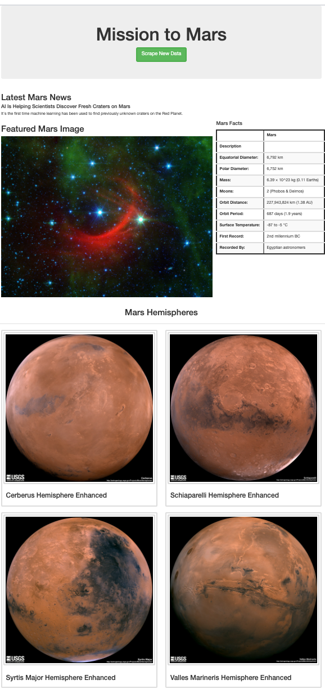

# Mission-to-Mars

## Overview
This project was undertaken to create a website that uses webscraping tools  to retrieve text and images from multiple other websites, store them in a database and then render the scraped information on a local host browser. We built webscraping scripts using Python3 in Jupyter Notebook and VS Code, that use Beautiful Soup and Splinter libraries to dynamically find most recent text, images and data tables on external websites, by referencing HTML and CSS tags. We built a workflow that uses Flask to run the Python3 code and output and store the retrieved data on a MongoDB database and then render the data on a local website.  THe local website has a button that scrapes any updated headlines, articles and images and shows the updated data from the source websites when the user clicks it.

## Resources

Software utilized: 
* Jupyter Notebook v. 6.0.3
* Visual Studio Code Version: 1.47.3
* MongoDB Compass
* HTML
* CSS
* Jinja

Python libraries used: 
* Pandas
* Datetime 
* Splinter
* Beautiful Soup
* Datetime

## Results

Screen shot of webscraping site:

